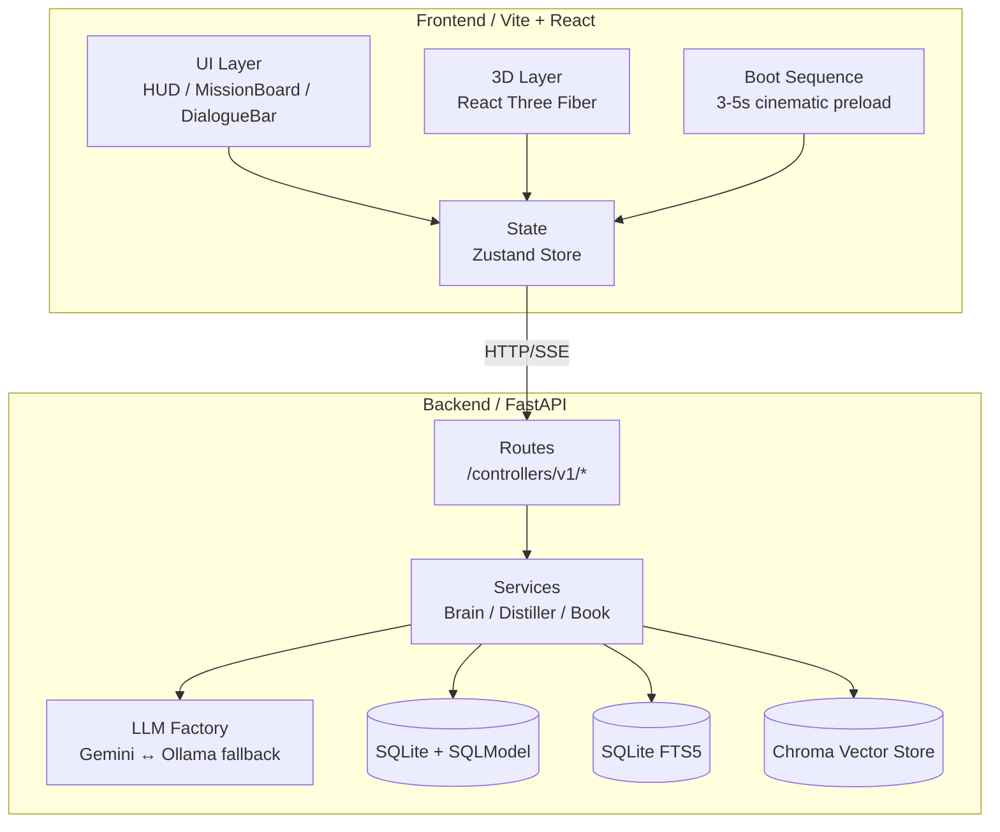
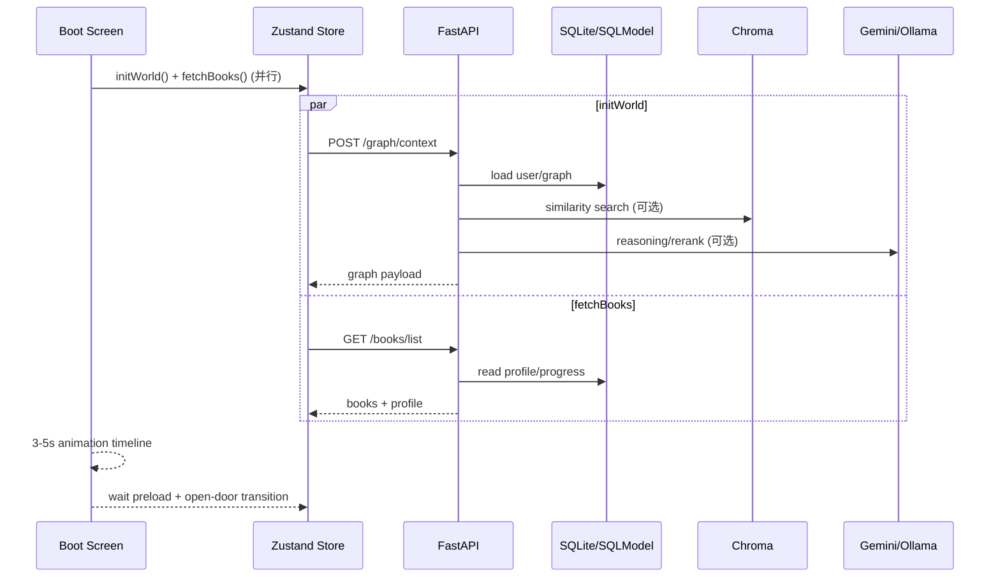

# Strand

Strand 是一个以 3D 词汇星图为核心的知识图谱 + RAG 系统，包含：

- **Frontend**：React + Vite + Zustand + R3F（3D 交互、命令台、HUD、多模态入口）
- **Backend**：FastAPI + SQLModel + SQLite + Chroma（图谱 API、任务系统、知识蒸馏与检索、Agent 接口）

---

## 架构图





## 目录结构（重构后）

```
Strand/
  backend/
    app/
      config/        # 配置、DB、LLM Provider 等基础设施
      controllers/   # 业务控制器（FastAPI handler）
      routes/        # 路由聚合与版本挂载
      middleware/    # 中间件封装
      models/        # 数据模型（SQLModel / DTO）
      services/      # 核心业务逻辑（Brain、Distiller、Book 等）
      eval/          # 评估框架与离线评测工具
    tests/
    main.py

  frontend/
    src/
      assets/        # 前端资源声明（指向 public 或构建资源）
      components/    # UI / Canvas 组件
      pages/         # 页面级组件
      services/      # API 客户端
      store/         # Zustand 状态
      utils/         # 工具与基础能力（Audio/Terrain 等）
    public/          # 静态资源（sounds、favicon 等）
```

---

## 模块职责

### Backend

- `app/config/`
  - `settings.py`：环境变量与配置加载（`.env`）
  - `database.py`：SQLite/FTS 初始化、Session、向量库、数据目录
  - `llm_factory.py`：Ollama/OpenAI/Gemini Provider 选择与容错
  - `logging.py`：脱敏日志过滤器
- `app/controllers/v1/`
  - `graph.py`：图谱扫描、候选搜索、链接创建（含 SSE）
  - `knowledge.py`：笔记、知识上传、蒸馏与索引
  - `mission.py`：任务生成/查询/完成/取消
  - `agent.py`：对话与视觉分析
  - `user.py`：用户与词书
- `app/routes/`
  - `v1/api.py`：聚合 v1 路由
  - `api.py`：对外导出 router（供 `main.py` 挂载）
- `app/middleware/`
  - `cors.py`：统一 CORS 注入

### Frontend

- `src/components/ui/DialogueBar.tsx`：命令台入口（Chat / Search / Vision / STT/TTS）
- `src/store/store.ts`：统一状态与 API 调度（agentState、SSE 等）
- `src/utils/AudioService.ts`：音效与 TTS 控制
- `src/assets/sounds.ts`：音效资源路径表（避免硬编码与拼写误差）

---

## 命名与组织规范

- 目录：`lower_snake_case`（如 `controllers/`、`middleware/`）
- 前端组件：`PascalCase.tsx`（如 `DialogueBar.tsx`、`MissionBoard.tsx`）
- 后端模块：`lower_snake_case.py`（如 `llm_factory.py`、`semantic_chunker.py`）
- 路由与控制器分离：`controllers` 存 handler，`routes` 仅做聚合挂载

---

## 本地运行

### Backend

```bash
cd backend
source venv/bin/activate
uvicorn main:app --reload --host 127.0.0.1 --port 8000
```

### Frontend

```bash
cd frontend
npm install
npm run dev
```

### 可选：启动动画配置

```bash
# 启动序列时长（ms，自动限制在 3000-5000）
export VITE_BOOT_DURATION_MS=3800
# 启动页铭牌信息（可选）
export VITE_APP_NAME="STRAND OS"
export VITE_APP_VERSION="v1.3.0"
```

---

## 比赛合规（Gemini + GenAI SDK + Google Cloud）

- Gemini：后端通过 `LLM_TYPE=gemini` + `GOOGLE_API_KEY` 使用 Gemini（文本与视觉）。
- GenAI SDK：Gemini 调用使用 Google GenAI SDK（`google-genai`），实现位于 [llm_factory.py](file:///Users/lijunyi/Code/Strand/backend/app/config/llm_factory.py)。
- Google Cloud 服务：知识上传支持写入 GCS（配置 `GCS_BUCKET` 即启用），实现位于 [knowledge.py](file:///Users/lijunyi/Code/Strand/backend/app/controllers/v1/knowledge.py)。

### Cloud Run 部署（Backend）

后端已提供容器化配置：[backend/Dockerfile](file:///Users/lijunyi/Code/Strand/backend/Dockerfile)。

```bash
gcloud auth login
gcloud config set project <YOUR_GCP_PROJECT_ID>
gcloud run deploy strand-backend \
  --source ./backend \
  --region <REGION> \
  --allow-unauthenticated \
  --set-env-vars LLM_TYPE=gemini,GOOGLE_API_KEY=***,GCS_BUCKET=***,GCS_PREFIX=raw_archive
```

部署证明建议：
- Cloud Run 服务详情页（绿色状态）+ Logs 滚动录屏
- 代码中 `google-genai` / `google-cloud-storage` 调用位置链接

---

## 测试与构建

### Backend

```bash
cd backend
source venv/bin/activate
python -m pytest -q
```

### Frontend

```bash
cd frontend
npx vitest run
npm run lint
npm run build
```

---

## 变更清单（目录重构）

### Backend

- `app/core/` → `app/config/`（settings/database/llm_factory/logging）
- `app/api/` → `app/controllers/` + `app/routes/`（控制器与路由聚合拆分）

### Frontend

- 删除未使用文件：
  - `src/components/ui/DataUplink.tsx`
  - `src/components/ui/Terminal.tsx`
  - `src/TerrainMap.tsx`
  - `src/DOCS.md`
- 新增 `src/assets/sounds.ts`，集中管理音效资源路径

---

## 迁移指南（团队协作）

### 后端导入路径变化

- `from app.core.database import ...` → `from app.config.database import ...`
- `from app.core.config import settings` → `from app.config.settings import settings`
- `from app.core.llm_factory import get_llm` → `from app.config.llm_factory import get_llm`
- `from app.api...` → `from app.routes...` 或 `from app.controllers...`

### 路由文件定位

- 旧：`app/api/v1/endpoints/*.py`
- 新：`app/controllers/v1/*.py`

---

## 参考文档

- 项目演进蓝图：[`plans/evolution.md`](file:///Users/lijunyi/Code/Strand/plans/evolution.md)
- 下一阶段规划：[`plans/evolution_next.md`](file:///Users/lijunyi/Code/Strand/plans/evolution_next.md)
- 测试清单：[`plans/test_plan_v1.2.6.md`](file:///Users/lijunyi/Code/Strand/plans/test_plan_v1.2.6.md)
