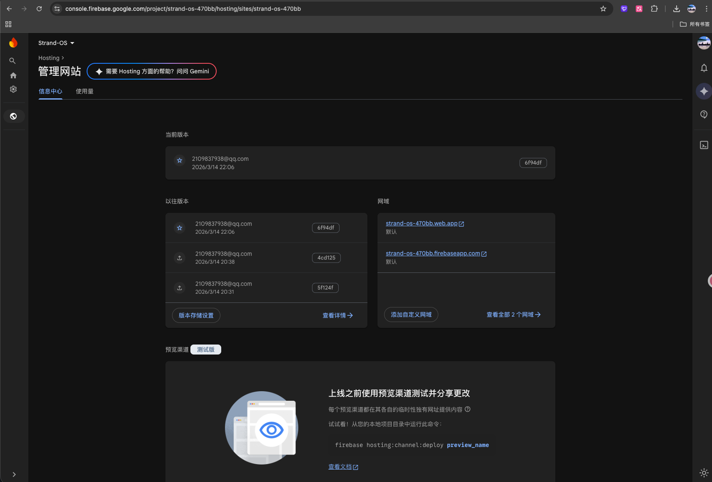

<a id="top"></a>

# Strand OS: Multimodal Cognitive Agent

<p align="center">
  
  
  
  
  
</p>

Strand OS is a spaceship-style multimodal cognitive agent for vocabulary learning and knowledge exploration.  
It renders your knowledge graph as an interactive 3D star map, while a tactical AI copilot (Gemini) drives retrieval, reasoning, and mission guidance.  
During boot, a cinematic sequence preloads graph state and missions so the first interaction feels instant.

## Table of Contents

- [Architecture Diagram](#architecture-diagram)
- [Key Features](#key-features)
- [Quick Start (Reproducible Testing)](#quick-start-reproducible-testing)
- [Usage](#usage)
- [Configuration](#configuration)
- [Technology Stack](#technology-stack)
- [GCP Deployment Proof](#gcp-deployment-proof)
- [Development Journey](#development-journey)

## Architecture Diagram


[Back to top](#top)

## Key Features

- Immersive boot sequence with parallel data preloading (3–5s configurable)
- 3D knowledge graph exploration (R3F) with terrain-aware nodes and links
- Missions system for daily learning loops (explore + review)
- Multimodal agent endpoints: chat + vision analysis (Gemini)
- RAG pipeline: distill uploads into high-signal memory and index in ChromaDB

[Back to top](#top)

## Quick Start (Reproducible Testing)

### Prerequisites

- Python 3.11+
- Node.js 18+
- A Google Gemini API key

### 1) Backend (FastAPI)

```bash
cd backend
python -m venv venv
source venv/bin/activate
pip install -r requirements.txt

cp .env.example .env
```

Edit `backend/.env`:

```bash
LLM_TYPE=gemini
GOOGLE_API_KEY=YOUR_KEY_HERE
```

Run:

```bash
uvicorn main:app --reload --host 127.0.0.1 --port 8000
```

### 2) Frontend (Vite + React)

```bash
cd ../frontend
npm install
npm run dev
```

Open:

- http://127.0.0.1:5173/

Then click “开始探索” to enter the boot sequence.

### 3) Run Tests

Backend:

```bash
cd ../backend
source venv/bin/activate
python -m pytest -q
```

Frontend:

```bash
cd ../frontend
npx vitest run
npm run lint
npm run build
```

Note: GitHub / Gitee typically provide a built-in copy button for fenced code blocks.

[Back to top](#top)

## Usage

### Web UI

- Explore: click nodes to jump and expand context
- Missions: complete daily targets to earn XP
- Console: use chat / search / vision to guide exploration

### Backend API (examples)

```bash
curl -s http://127.0.0.1:8000/ | jq
curl -s http://127.0.0.1:8000/user/profile | jq
curl -s -X POST http://127.0.0.1:8000/graph/context -H 'Content-Type: application/json' -d '{"word":"strand"}' | jq
```

[Back to top](#top)

## Configuration

### Backend (`backend/.env`)

- `LLM_TYPE=gemini` (default)
- `GOOGLE_API_KEY=...` (required for Gemini)
- `GEMINI_MODEL=gemini-2.5-pro` (optional override)

### Frontend (`frontend/.env` or shell env)

- `VITE_BOOT_DURATION_MS=3800` (optional, clamped to 3000–5000)
- `VITE_APP_NAME=STRAND OS` (optional)
- `VITE_APP_VERSION=v1.3.0` (optional)

[Back to top](#top)

## Technology Stack

- FastAPI (backend API)
- SQLModel + SQLite (relational state)
- ChromaDB (vector store)
- Google GenAI SDK (`google-genai`) for Gemini
- Google Cloud Storage (GCS) for uploads/archives (optional)
- React + Vite + Zustand (frontend + state)
- React Three Fiber (R3F) + drei (3D star map + effects)

[Back to top](#top)

## GCP Deployment Proof

This project is designed to run on Google Cloud Platform (Cloud Run).  
Deployment proof artifacts:

- Frontend hosting proof (screenshot):

  

- Frontend hosting proof (video): https://youtu.be/KlEAxLWCPoI
- Cloud Run service (screenshot): TODO
- Cloud Run logs (video link): TODO

[Back to top](#top)

## Development Journey

See the build story and design rationale in: [JOURNEY.md](JOURNEY.md)

[Back to top](#top)
